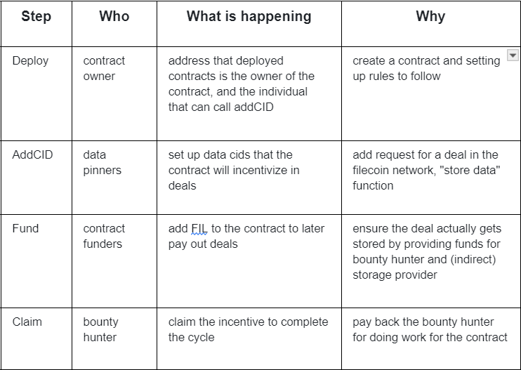

# Mount Protocol Design

## Concepts

**Data Bounties**: smart contracts can pool together funds to store a particular CID (content identifier). Funds would only payout after proof is provided that the data has successfully been stored on Filecoin.
**DataDAOs**: DAOs formed around data that a community, business, or organization cares about. Members can join the DAO, for example, by proving they have stored a piece of the dataset or have contributed to a pool.
**Content-first NFTs**: a DealID is a unique identifier that describes a storage deal (an agreement between client and miner to store a piece of content). Every single DealID on Filecoin can be considered an NFT — a unique identifier of the underlying content. A marketplace could emerge around those distinct DealIDs, with people buying and selling VR content, games, 3D printing models, and more.
**Verifiable Compute**: CIDs are not just pieces of information; they can be algorithms too that are stored on Filecoin. Compute and data together generate more data, powering use cases like machine learning and verifiable compute.
**Layer 2 Protocols**: Layer 2 applications open up the doors for near-infinite possibilities. Developers can leverage the building blocks of Filecoin to fill in the gaps and provide new experiences to miners, clients, and network participants. Some ideas include: perpetual storage solutions, content delivery protocols, and alternative incentives for clients to use Filecoin.

## Mount protocol

The concept of the Data DAO Protocol, as described, involves tokenizing social interactions related to data supply and consumption within the framework of a decentralized autonomous organization (DAO). This approach integrates the principles of decentralized governance, tokenization, and social interactions to create a framework for managing data assets within a DAO. Here are some key aspects and potential implications of this concept:

1. Tokenized Social Interactions: By tokenizing social interactions, the Data DAO Protocol can create a system where participants are incentivized and rewarded for contributing, supplying, consuming, or interacting with data within the DAO ecosystem. Tokens can be used to represent ownership, access rights, or contributions to the data assets, and can serve as a means of incentivizing and aligning the interests of participants.
2. Data Supply and Consumption Interactions: The protocol can facilitate the exchange and utilization of data assets within the DAO, enabling participants to supply, consume, and interact with data in a tokenized and incentivized manner. This can include mechanisms for data sharing, data access, data analysis, and other forms of data-related interactions within the DAO ecosystem.
3. Decentralized Autonomous Organization (DAO): By operating within the context of a DAO, the protocol leverages decentralized governance mechanisms to manage and govern data-related activities. This can involve decentralized decision-making, voting mechanisms, and community-driven governance processes for managing data assets, protocols, and incentives within the DAO.
4. Incentivizing Data Contributions and Quality: Tokenized social interactions can be used to incentivize high-quality data contributions, data curation, and data-related activities within the DAO. By aligning incentives with the quality and value of data assets, the protocol can encourage participants to contribute and maintain high-quality data resources within the ecosystem.
5.  Community-Driven Data Governance: The protocol can enable community-driven governance of data assets, allowing participants to collectively determine the rules, protocols, and incentives governing data supply, consumption, and interactions. This can foster a sense of ownership and participation among DAO members and align the governance processes withthe interests of the community.

Overall, the Data DAO Protocol's approach to tokenized social interactions for data supply and consumption interactions within a DAO represents a novel way of managing and incentivizing data-related activities. By integrating tokenization, social interactions, and decentralized governance, the protocol aims to create a framework for sustainable and community-driven management of data assets within a decentralized ecosystem.

## Leveraging DeFi’s flywheel to build scale effects of datasets

Leveraging decentralized finance's (DeFi) flywheel to build scale effects of datasets involves harnessing the principles and mechanisms of DeFi to create network effects and scale within the context of data-related applications. This approach aims to use the momentum and positive feedback loops inherent in DeFi to drive the growth, adoption, and value creation of datasets.

## Managing the Flow of Data

### Aggregator / Caching Nodes

In our perpetual storage protocol, the client specifies some data that should be replicated. This leads to an interesting UX question — in many cases, users don’t want to have to wait for storage proofs to land on-chain to know the data will be stored and replicated. Instead, users might prefer to have their data persisted by an incentivized actor with guarantees that all other services will occur, similar to the role that data on-ramps play (like Estuary and NFT.Storage).
One solution to this UX question might be to design a protocol for an incentivized IPFS nodes operating with weaker storage guarantees to act as incentivized caches. These nodes might lock some collateral (to ensure good behavior, enact penalties if services are not rendered properly), and when data is submitted return a commitment to store the data Filecoin according to the specified requirements of the client. This commitment might include a merkle proof (showing the client’s data was included inside of a larger set of data that might be stored in aggregate), a max block height by which the deal would start, etc.
Revenue Model: One neat feature of this design for aggregator services is they can take small microtransactions on service on both sides — a small fee from clients (pricing the temporary storage costs, compute for aggregation, bandwidth costs, etc), and potentially an onboarding bounty from an auction protocol (an example described in the Trustless Notaries section below).

### Trustless Notaries (Auction Protocols)

To actually make the deal on Filecoin, we might want to automate the process of using Filecoin Plus. Filecoin has two types of storage deals — verified deals and unverified deals. Verified deals refer to storage deals done via the Filecoin Plus program, and are advantageous for data clients as it leverages Filecoin’s network incentives to help reduce the cost of storage.
Today, Filecoin Plus uses DataCap (allocated by Notaries) to help imbue individual clients with the ability to store fixed amounts of data on the network. Notaries help add a layer of social trust to publicly verify that clients are authentic and prevent sybils from malicious actors. This works when clients are human — but it leaves an open question on how one can verify non-human (e.g. smart contract!) actors.
One solution would be to design a trustless notary. A trustless notary is a smart contract, where it would be economically irrational to attempt to sybil the deal-making process.

What might this look like? A trustless notary might be an on-chain auction, where all participants (clients, storage providers) are required to lock some collateral (proportional to the onboarding rate) to participate. When the auction is run, storage providers can submit valid bids (even negative ones!) accommodating the requirements of the client. By running an auction via a smart contract — everyone can verify that the winning bidder(s) came from a transparent process. Economic collateral (both from the clients and storage providers) can be used to disincentivize malicious actors and ensure closed auctions result in on-chain deals. The auction process might also allow for more sophisticated negotiations between a prospective client and storage provider — not just on the terms of the deal, but on the structure of the payment as well. A client looking to control costs might offer a payment in fiat (to cover a storage provider’s opex) along with a loan in Filecoin (and in return expect a large share of the resulting block rewards).
Revenue Model: For running the auction, the notary maintainer might collect some portion of fees for the deal clearing, collect a fee on locked collateral (e.g. if staked FIL is used as the collateral some slice of the yield), or some combination of both. One nice artifact about running a transparent auction is it can also allow for negative prices for storage (which can be used to fund an insurance fund for datasets, bounties for teams that help onboard new clients, distributed to tokenholders who participate in governance of the trustless notary, etc).
In our perpetual storage use case, we’d likely want to be able to leverage the trustless notary to trigger the deal renewals and auctions any time a dataset is under replicated. On the first iteration, this means that storage providers might grab the data out of the caching nodes and on subsequent iterations from other storage providers who have copies of the data.

### Bounty Protocol

A simple deal bounty contract consists a list of the data CIDs that it incentives to store on Filecoin. Once a storage deals is made for the listed data, the data bounty hunter can claim the data bounty by providing the deal ID. The contract will check with the Filecoin storage market to confirm whether the supplied deal ID is activated and stores the claimed data. Once validated, the deal bounty contract will pay the bounty hunter out.

#### Deal Bounty Contract Modular Breakdown

The deal bounty contract consists of four conceptual steps:

Example variants in terms of building blocks

- A simple data DAO can be implemented with a client that adds the bounties through a voting mechanism
- Perpetual storage contracts can by implemented with clients that funds deals with defi mechanisms and recycle cids from expiring deals into their authorization sets
- Trustless third party data funding can be implemented with 1) public ability to list the bounty 2) a funding mechanism that associates payments with particular cids

## Managing Flows of Funds

A sample view on the economic flows for enabling perpetual storage. Note other DeFi primitives might help mitigate risk and volatility (e.g. options, perpetuals).

The supporters of DAO (Decentralized Autonomous Organization) would claim it’s “the twilight of the corporate structure” or “transforming production relations,” and “DAO is the Holy Grail.”

The critics of DAO would argue, “DAO has no value,” “The value of DAO lies in evading legal risks,” and “No one can truly organize a community through DAO.”

In a cryptocurrency community where almost no projects have created a decentralized platform to the likes and scale of Reddit, and information are only made public through centralized platforms like Twitter, how can we discuss DAO? Let’s explore the process of constructing a decentralized community attention network starting from the origins of cryptocurrency and utilizing its innovative mechanisms.

### Pool

Bitcoin, as the first DAO, uses cryptocurrency $BTC to reward miners for contributing computational power, forming mining pools to ensure the continuous operation of the Bitcoin system for over a decade.
From a DAO perspective, Ethereum and other PoS chains reward token holders for staking their tokens to form $POS token pools, maintaining the basic economic mechanisms and consensus security of PoS chains.
Uniswap, as a prominent DeFi platform, allows thousands of DeFi platforms to reward liquidity providers with transaction fees through liquidity mining, creating liquidity pools to enable decentralized trading of DeFi platform tokens.

### Data Pool

DataDAO utility is similar to the narrative of an AMM (automated market making, like uniswap, bancor, balancer etc…) for liquidity pooling - **the value of each isolated individual liquidity is not valuable in it’s own**, but the ability of them to pool together unlock a tremendous amount of value in the form of large token exchange liquidity pools. Same applies for DataDAO, instead of Capital → Data. - the pooling of fragmented data together can create a valuable dataset.
The development of AI has increasingly made data a critical resource, DataDAO mission is to allow the pooling of datatokens into a meaningful and valuable dataset who’s value is greater than the sum of it’s parts alone. Laying the foundations to a fairer and more inclusive value distribution in any product or platform, to the members who actually generate it. It also serves as a demand generating tool — anyone in need for specific data set can source this data from the community, and the community can join forces together to create it. 
For a community, it functions as a DataDAO network. Community members invest their money and datasets, aggregating their datasets to form a data economy community.
DeFi platforms utilize the LP tokens provided by Uniswap factory contracts to measure the contribution of liquidity providers to the token trading pairs, injecting transaction fees into LP token pools and thereby sharing its value with liquidity providers. Similarly, data communities can use tokens to measure the contributions of community members, injecting the captured value of the community (DataDAO network) into data tokens, benefiting those who contribute datasets.
The community (DataDAO network) continues to expand through datasets. Using community members’ interactions with datasets and an extensible voting system, we can reward datasets owners and curators (fund contributors) using data tokens.
Thus, just as DeFi platforms form liquidity pools, communities rely on owners and curators to form decentralized data pools. Based on this, anyone or any organization can directly engage in datasets trading with the community, bypassing centralized platforms like Google.
Datasets owners can tokenize datasets as NFT in the community, and when community members mint the NFT, the community can receive a portion of the proceeds. Alternatively, Web3 projects can inject curation rewards into their datasets, distributing a portion of the rewards to curators and transferring the rest to the community treasury. Even community members can embed transactions from Uniswap or Opensea into their datasets, sharing a portion of the service fee with the community treasury while completing the transaction. In this way, even small communities can capture value in the crypto world and drive network expansion.

